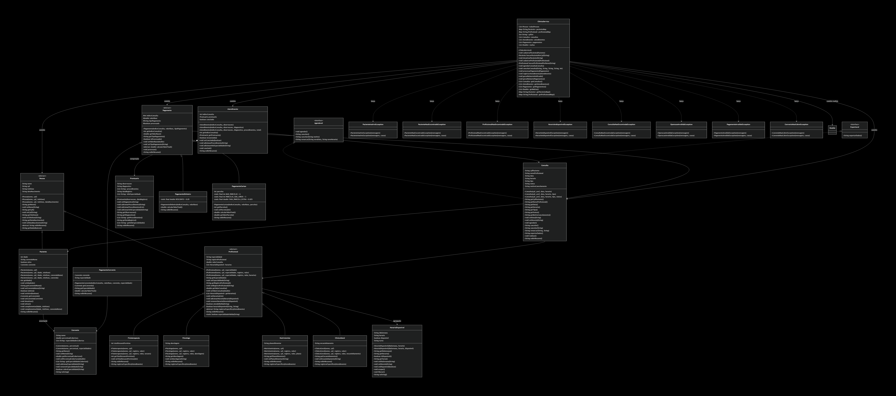

# 🏥 Clínica VidaPlena - Sistema de Gestão

# diagrama do projeto




## 📋 Descrição do Sistema

O **Sistema de Gestão da Clínica VidaPlena** é uma aplicação Java para gerenciamento de clínica multidisciplinar, desenvolvida como projeto final da disciplina de Programação Orientada a Objetos.

O sistema foi desenvolvido seguindo os princípios da **Programação Orientada a Objetos**, aplicando conceitos como **abstração, encapsulamento, herança, polimorfismo, exceções personalizadas e coleções**.

### Funcionalidades Desenvolvidas

#### Pacientes
- Cadastro mínimo, intermediário e completo
- Complementação de cadastro
- Busca instantânea por CPF (HashMap)
- Desativação/ativação de pacientes
- Validação robusta de dados (Jornada 14)

#### Profissionais
- Cadastro de 4 especialidades: Clínico Geral, Fisioterapeuta, Psicólogo, Nutricionista
- Hierarquia com 3 níveis de herança
- Registro de horários disponíveis (agregação)
- Busca por especialidade

#### Consultas
- Agendamento por profissional (Jornada 5)
- Agendamento por especialidade (Jornada 6)
- Tratamento de conflitos com sugestão de horários (Jornada 7)
- Cancelamento com cálculo de multa (Jornada 9)
- Remarcação (Jornada 10)
- Impedimento para pacientes inativos (Jornada 18)

#### Atendimentos
- Registro com prontuário (composição - Jornada 24)
- Registro especializado por especialidade (Jornada 25)
- Histórico clínico completo

#### Pagamentos
- Pagamento em Dinheiro (5% desconto - Jornada 21)
- Pagamento em Cartão (parcelamento até 6x - Jornada 22)
- Pagamento por Convênio (cobertura percentual - Jornada 23)
- Validação de cobertura (Jornada 20)

#### Relatórios
- Relatório Unificado de Pessoas (polimorfismo - Jornada 15)
- Relatório de Pagamentos (polimorfismo)
- Relatório por profissional e período
- Resumo financeiro com multas

#### Exportação
- Exportação de dados (Jornada 26 - interface Exportavel)

---

---

## 🚀 Orientações para Compilação e Execução

### Pré-requisitos
- Java JDK 11 ou superior
- Git (para clonar o repositório)

### Compilação

```bash
# Navegue até a pasta do projeto
cd ProjetoPOO-Etapa02

#java Main


